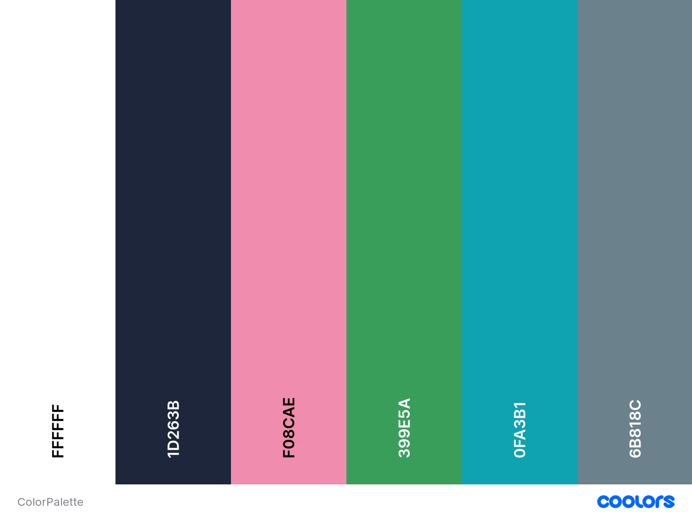

# This is the source code for my personal website - a developer portfolio.

    
    
    
    

## Table of Contents

- [Design](#design)
  - [Fonts](#fonts)
  - [Color Scheme](#color-scheme)
- [Built With](#built-with)
- [Creator / Maintainer](#creator--maintainer)

---

## Design

### Fonts

[Fire Code](https://fonts.google.com/specimen/Fira+Code) - headings and code text

[Nunito](https://fonts.google.com/specimen/Nunito) - normal text

### Color Scheme

- White - all normal text color
- Oxford Blue - page background color, text color on white background
- Charm Pink - links, nav bar item hover, icon hover color
- Shamrock Green - Charm Pink links hover color
- Viridian Green - project skill text color
- Slate Gray - mobile navbar background color

<!--  -->

## Built With

- 💙 [HTML5](https://www.w3schools.com/html/)
- 💜 [CSS3](https://www.w3schools.com/css/)
- 💙 [JavaScript](https://www.w3schools.com/js/DEFAULT.asp)
- 💜 [Flaticon](https://www.flaticon.com/) and [FontAwesome](https://fontawesome.com/v5.15/icons?d=gallery&p=1) for the icons
- 💜 [Netlify](https://www.netlify.com/) for hosting
- 💙 [Figma](https://www.figma.com/) for design and prototyping tools

---

## Creator / Maintainer

Pratik Shastrakar ([pratikks01](https://github.com/pratikks01))

If you have any questions, comments, or concerns, feel free to contact me below.

  

